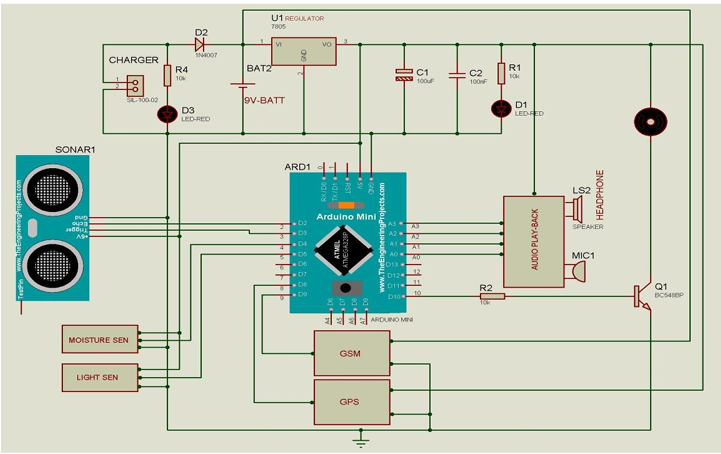

# SMART-BLIND-STICK-FOR-BLIND-PEOPLE-WITH-GSM-AND-GPS-
The Smart Blind Stick with GSM and GPS is an assistive technology project designed to help visually impaired individuals navigate safely.

The stick integrates ultrasonic sensors, soil moisture sensors, and an LDR to detect obstacles, water/mud, and light conditions. It alerts the user through audio messages, vibration motors, and buzzers.

In case of emergency, the system uses a GSM module to send an SMS with GPS coordinates to a caretaker, enabling quick assistance.

This project aims to provide a low-cost, reliable, and portable solution for improving mobility and safety of blind and visually impaired people.

## 📌 Project Overview
The **Smart Blind Stick** is an assistive device designed to help visually impaired people navigate safely.  
It detects obstacles, water/mud, and light conditions, and provides alerts through **audio messages, vibration motors, and buzzers**.  
In emergencies, it sends an **SMS with GPS coordinates** to the caretaker via GSM.

## ⚙️ Features
- Obstacle detection with Ultrasonic sensor
- Soil moisture sensor for water/mud detection
- Light detection using LDR
- Audio alerts using sound playback module
- Vibration feedback for physical alerts
- Emergency SMS with GPS location via GSM

## 🛠️ Hardware Requirements
- Arduino Mini / Uno
- Ultrasonic Sensor
- GSM SIM800 Module
- GPS Module
- Soil Moisture Sensor
- Light Sensor (LDR)
- Sound Playback Module
- Vibrator Motor
- 4V Battery

## 💻 Software Requirements
- Arduino IDE
- Proteus (for simulation)

## 🔧 Circuit Diagram

